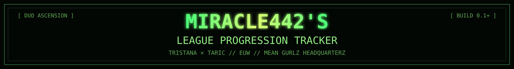
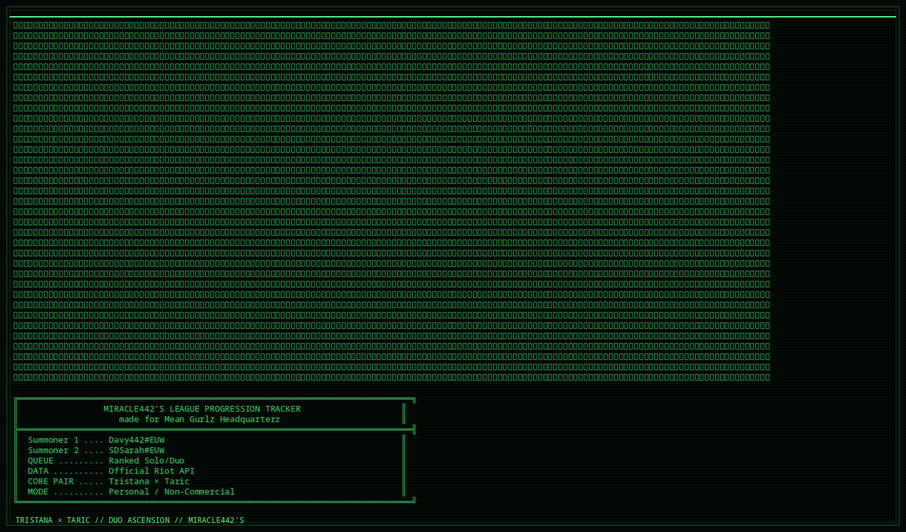

[README.md](https://github.com/user-attachments/files/32715361/README.md)
<p align="center">
  
</p>

<p align="center">
  
</p>

<p align="center">
  <strong>TRISTANA × TARIC // EUW // DUO ASCENSION PROTOCOL</strong><br>
  <sub>Personal Riot API progression tracker made for Mean Gurlz Headquarterz 💅🫦</sub>
</p>

<p align="center">
  
  
  
  
</p>

<p align="center">
  
</p>

## `[ RELEASE METRICS ]`

```text
► PROJECT ........: Miracle442's League Progression Tracker
► ENGINE .........: Official Riot API + Local Persistent History
► REGION .........: EUW
► QUEUE ..........: Ranked Solo/Duo
► CORE PAIR ......: Tristana × Taric
► HEADQUARTERZ ...: Mean Gurlz
► VISUAL ARCH ....: ASCII / ANSI / techno-occult terminal codex
► BUILD ..........: 0.1+
```

<table>
<tr>
<td width="50%">

### `[ SUMMONER 01 ]`
```text
ID ........ Davy442#EUW
RANK ...... SILVER IV
LP ........ 81
TARGET .... GOLD IV
SEASON .... 23-10
RECENT .... 14-6
```

</td>
<td width="50%">

### `[ SUMMONER 02 ]`
```text
ID ........ SDSarah#EUW
RANK ...... SILVER IV
LP ........ 68
TARGET .... GOLD IV
SEASON .... 193-190
RECENT .... 12-8
```

</td>
</tr>
</table>

---

## `[ LIVE RANK TRACKING ]`

The control room tracks the duo's ranked state directly through the official Riot API.

- Current **Tier / Division / LP**
- Season **Wins / Losses**
- Season **Win Rate**
- Recent **W/L record**
- Recent **Win Rate**
- Last-10 form
- Riot ID → **PUUID**
- Ranked Solo/Duo filtering
- Live data refresh

```text
CURRENT .......... SILVER IV / 81 LP
TARGET ........... GOLD IV
REMAINING ........ 219 RP

PROGRESS
[▓▓▓▓▓▓▓▓▓▓▓▓▓▓░░░░░░] 68%
```

---

## `[ IMPROVEMENT ENGINE ]`

Instead of only showing rank, the tracker compares recent play against the previous sample.

```text
METRIC              LAST 10      PREV 10       DELTA
──────────────────────────────────────────────────────
CS/MIN ............ 7.40         6.70          +0.70 ↑
KDA ............... 2.59         2.31          +0.28 ↑
DMG/MIN ........... 611          554           +57   ↑
DEATHS/GAME ....... 5.4          6.8           -1.4  ↑
VISION/MIN ........ 1.28         1.12          +0.16 ↑
```

<details>
<summary><strong>► PERSONAL PERFORMANCE TARGETS</strong></summary>

<br>

- Target **CS/min**
- Target **KDA**
- Target **Damage/min**
- Target **Vision/min**
- Maximum **Deaths/game**
- Improvement / decline indicators
- Completion bars
- Automatic trend observations

```text
CS/MIN ............ [▓▓▓▓▓▓▓▓▓▓▓▓▓▓▓▓▓░░░]  7.4 / 8.0
KDA ............... [▓▓▓▓▓▓▓▓▓▓▓▓▓▓▓░░░░░]  2.59 / 3.00
DMG/MIN ........... [▓▓▓▓▓▓▓▓▓▓▓▓▓▓▓▓░░░░]  611 / 700
DEATH CONTROL ..... [▓▓▓▓▓▓▓▓▓▓▓▓▓▓▓▓▓▓░░]  5.4 / ≤6.0
```

</details>

---

## `[ GOAL SYSTEM ]`

Each summoner has an independent climb target.

<table>
<tr>
<td>

```text
┌──[ DAVY442 ]──────────────────────┐
│ CURRENT .... SILVER IV / 81 LP   │
│ TARGET ..... GOLD IV             │
│ REMAINING .. 219 RP              │
│ GOAL ................. 68%       │
└──────────────────────────────────┘
```

</td>
<td>

```text
┌──[ SDSARAH ]──────────────────────┐
│ CURRENT .... SILVER IV / 68 LP   │
│ TARGET ..... GOLD IV             │
│ REMAINING .. 232 RP              │
│ GOAL ................. 65%       │
└──────────────────────────────────┘
```

</td>
</tr>
</table>

Targets include:

`RANK` · `DIVISION` · `LP` · `TARGET DATE` · `RP REMAINING` · `GOAL %` · `CLIMB PACE` · `ETA`

---

## `[ DUO LAB ]`

```text
PAIR                    GAMES       RECORD       WR
───────────────────────────────────────────────────
TRISTANA + TARIC          14         10-4        71%
SAMIRA + TARIC             3          2-1        67%
```

The duo analysis layer includes:

- Shared games / W-L / Win Rate
- Last-10 duo form
- Champion pair combinations
- Pair-specific WR and KDA
- Blue / Red side performance
- Dragons / Barons / Towers
- First Dragon %
- Average game duration
- Combined deaths
- Combined damage contribution

---

## `[ SESSION CONTROL ]`

```text
► START SESSION NOW
► END SESSION
► SESSION W/L
► SESSION WIN RATE
► SESSION TIMER
► RANK MOVEMENT
► PLANNED GAMES
► STOP-AFTER-X-LOSSES
► SESSION FOCUS
```

> The session system is also a tilt-control layer: decide the plan before queueing, then measure whether the session followed it.

---

## `[ MATCH DATABASE ]`

```text
DATE         RESULT   DAVY442                 SDSARAH               TIME
────────────────────────────────────────────────────────────────────────
2026-09-27   LOSS     TRISTANA 4/8/2          TARIC 0/6/10          27m
2026-09-27   WIN      TRISTANA 14/3/3         TARIC 4/4/20          34m
2026-09-25   WIN      SAMIRA 7/9/7            TARIC 2/6/19          30m
```

`WIN / LOSS FILTER` · `CHAMPION SEARCH` · `DURATION` · `KDA` · `DUO RESULT`

---

## `[ LOCAL HISTORY CORE ]`

Riot gives the current rank and match history, but not a complete historical LP-after-every-game ledger.

The tracker therefore stores small local snapshots:

```text
timestamp
player
tier
division
LP
effective_rank_points
```

That local history enables:

- Long-term progression graphs
- Session rank movement
- Climb pace
- Historical goal %
- Better projections

---

## `[ SYSTEM FLOW ]`

```text
01. AUTH       -> Enter Riot API key
02. RESOLVE    -> Riot ID -> PUUID
03. FETCH      -> Ranked + Match-V5 data
04. ANALYZE    -> Stats / trends / champion pairs
05. TARGET     -> Rank + performance goals
06. SESSION    -> Track active ranked session
07. HISTORY    -> Store progression snapshots locally
08. ASCEND     -> Repeat until the prophecy is fulfilled
```

---

## `[ DATA / PRIVACY ]`

- Uses the official Riot API
- No U.GG / XDX scraping required
- API credentials must **never** be committed to GitHub
- Local history remains local
- Personal / non-commercial project

<p align="center">
  
</p>

```text
"I jagten på det uopnåelige præsenterer vi hermed
 Miracle442's League Progression Tracker
 made for Mean Gurlz Headquarterz 💅🫦"

                    TRISTANA × TARIC
                      DUO ASCENSION
```

### Disclaimer

Miracle442's League Progression Tracker is a personal project and is not endorsed by Riot Games.  
League of Legends and Riot Games are trademarks or registered trademarks of Riot Games, Inc.
